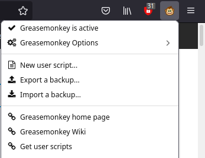
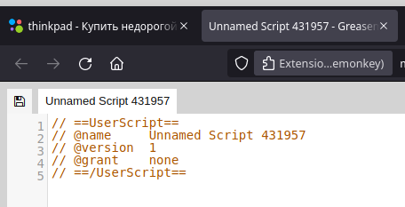
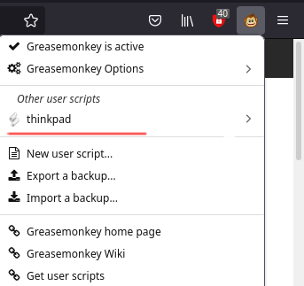
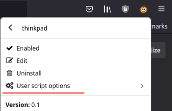
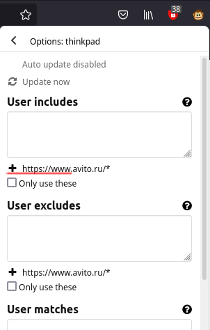

### Setting up developer's environment:

Developed on FireFox 90.0

#### Use extensions:

##### for ad blocking: [AdBlocker Ultimate](https://addons.mozilla.org/en-US/firefox/addon/adblocker-ultimate/)

##### for running user scripts: [Grease Monkey](https://addons.mozilla.org/en-US/firefox/addon/greasemonkey/)

#### Include JS libraries: JQuery [v 3.6 minified](https://code.jquery.com/jquery-3.6.0.min.js)

### How to use:

1. Download/Open firefox
2. Add grease monkey addon
3. Click on grease monkey icon
4. Click on `New user script...`

5. It will open a new Tab with unnamed script

   1. Select All (Ctrl+A) and Delete
   2. Copy source code from `avito.user.js` and paste into edit area
   3. Save, click on diskette icon
   4. Close edit tab
   5. 
6. Get on https://avito.ru and Click on Grease monkey icon

7. In section "Other user scripts" click on "Thinkpad"

8. Then click on "User script options"

9. In `user includes section` click on Plus sign with `https://avito.ru/*` line near it

10. Reload the page, it should greet you with alert message

### Similar projects

https://greasyfork.org/en/scripts/371256-avito-cleaner

https://userstyles.org/styles/browse?search_terms=avito&type=false

11. On search page pick filter "only from individuals" (частные)

### TODO List:

1. Figure out that we on search page

#### Distinguish weather search entity:

##### is paid

##### is company

#### check up on wiki:

##### Problems with PWM

##### Problems with ThunderBolt

##### Sort out "not real thinkpads" like SL, L, R, E series

#### Work out second queue problem

#### Use github gist to serve your script

#### Make another script for suggestions (when on root page)

#### Make filters be pluggable

### Closed tasks:

1. Hide VIP bulletins
2. Hide bulletins from obvious companies

### To hide

Скупка https://www.avito.ru/user/934c7dfe29e806b93b3b8a630b4e2a92/profile

Комиссионка бутово https://www.avito.ru/user/d30e6bc93babe8eaa86ae1eb76e730e0/profile

ShopOnTheSofa https://www.avito.ru/user/459f377e80cf0c7198ba54578c32a415/profile

Олег https://www.avito.ru/user/f88da0bf831961b0db0052fefd7eee45/profile

Ноутбук с гарантией https://www.avito.ru/user/265db35a626e61d7a05fde4b70e85f84/profile

Корпоративная техника https://www.avito.ru/user/864ee4e704f62bcefeb26287e42a4d94/profile

TECHNO CITY https://www.avito.ru/texno_city?gdlkerfdnwq=102&shopId=1117613&page_from=from_items_list&iid=2265207514

Ноутбуки оптом черная пятница https://www.avito.ru/user/aa4e6f07dae278b90111d97bda1a7468/profile

Арена https://www.avito.ru/user/9daa4bf083d2f4201ac69ac73eb58350/profile

